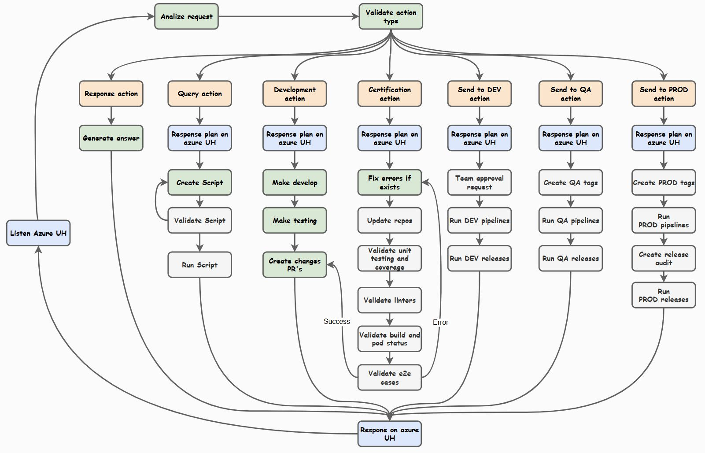

## 🚀 Credit Pro Max

¡Bienvenidos! 👋 

Soy Cesar Torres, candidato al rol de Líder Técnico en el Banco Caja Social. Este proyecto nace como parte de la **Prueba Técnica – Proceso de Selección Interno BCS – Líder Técnico Backend, Frontend y Liderazgo Técnico Integral**, y busca demostrar mediante un **caso de uso de credito digital** mi capacidad para diseñar y liderar soluciones end-to-end en un contexto bancario realista.  

Este caso de uso está pensado para demostrar cómo, utilizando agentes de inteligencia artifical y otras estrategias, es posible empezar a orquestar y automatizar de manera controlada el ciclo de vida del desarrollo de software. Esto no solo asegura mejores resultados en los equipos, sino que también permite enfocar los esfuerzos en lo que realmente importa: **la generación de valor**. 💎

<strong>🧩 Necesidad y propuesta</strong>

### Estado técnico actual

Actualmente contamos con **múltiples productos funcionando, en desarrollo y en evolución**, lo cual trae consigo una serie de fortalezas y también algunos retos importantes.

**Pros**

- Productos funcionando exitosamente.  
- Nuevos productos y evoluciones.  
- Infraestructura y base tecnológica común.  
- Personas que conocen los productos y que tienen la capacidad de gestionarlos y evolucionarlos.  
- Luz verde para integrar IA en nuestros procesos.  

**Contras**

- Entre más crece un producto, más difícil es de gestionar (foco en la evolución funcional y no en la evolución estructural).  
- Múltiples procesos y configuraciones duplicadas (cada producto ha evolucionado de forma independiente).  
- El personal no ha incrementado, pero sí ha incrementado la complejidad y la cantidad de desarrollo tecnológico (de nuevo, foco en la evolución funcional y no en la evolución estructural).  

Debemos llegar a un punto de equilibrio entre lo funcional y lo estructural, garantizando que nuestros logros alcanzados se mantengan.

---

### Propuestas técnicas para fortalecer nuestra parte estructural

Para abordar esta necesidad y lograr ese equilibrio entre lo funcional y lo estructural, mi propuesta se apoya en tres pilares complementarios:

1. **Git como mecanismo flexible de transversalidad**  
2. **AI Agents estándar y customizados como mecanismo de innovación**  
3. **E2E Testing como mecanismo de eficiencia**  

#### Git como mecanismo flexible de transversalidad

La idea con Git no es solo versionar código, sino construir **bases comunes** que actúen como “configuraciones padre” desde las que heredan nuestros servicios. Esto nos permite que cada equipo y cada producto sigan evolucionando a su propio ritmo, pero siempre con un punto de referencia claro sobre qué es común y qué es particular. Cuando aparecen diferencias, Git deja de ser solo una herramienta técnica y se convierte en un **“ojo absoluto, pero no restrictivo”**: nos muestra con precisión dónde nos estamos desviando y nos permite decidir, con calma y en el momento correcto, si esa diferencia debe mantenerse, alinearse o convertirse en un nuevo estándar. Es una estrategia **gradual y AI‑friendly**, pensada para convivir con el estado actual sin frenar la evolución, y que abre conversaciones concretas sobre cambios reales en lugar de discusiones abstractas sobre “cómo debería ser la configuración ideal”.

#### AI Agents estándar y customizados como mecanismo de innovación

En cuanto a IA, ya hemos dado varios pasos importantes: hay curiosidad, hay laboratorios, hay formación y existe luz verde para experimentar con herramientas y asistentes de código. Al mismo tiempo, la industria se está moviendo hacia modelos premium y **arquitecturas de AI Agents** que permiten orquestar y gobernar esos modelos de forma seria, alineada con las necesidades del negocio. La propuesta es dejar de ver la IA solo como “una herramienta que ayuda”, y empezar a tratarla como un **actor dentro del flujo de trabajo**, a través de agentes estándar y customizados que automaticen tareas completas: lectura de contexto, generación de código, refactor, creación de pruebas, documentación y certificación. Un ejemplo concreto es un **agente de desarrollo basado en un grafo de decisiones**, capaz de escoger rutas distintas según el tipo de necesidad (responder, desarrollar, certificar, hacer merge) y trabajar integrado con nuestros repositorios y pipelines. No se trata solo de escribir más rápido, sino de incorporar la IA en el diseño del propio proceso de desarrollo.

#### E2E Testing como mecanismo de eficiencia

Por el lado de las pruebas, hoy contamos con unitarias y buena cobertura, pero eso no siempre se traduce en la tranquilidad de que “todo funciona junto”: faltan bases de datos reales, entornos representativos e integraciones completas, y mucho del esfuerzo de QA sigue siendo manual, repetitivo y externo al flujo natural de DevOps. Apostarle a **E2E Testing** es cambiar esa conversación. Significa tener suites automatizadas que ejercitan el sistema de punta a punta, que viven dentro de los proyectos, que se corren en los pipelines y que usan tecnologías y estándares consistentes. Esto permite que los equipos de desarrollo validen por sí mismos el comportamiento real del sistema, mientras QA se enfoca en diseñar y certificar escenarios de negocio apoyados en automatización, en lugar de repetir pruebas manuales una y otra vez. El resultado es doble: **más confianza en cada despliegue** y **más tiempo disponible para pensar en nuevos escenarios y mejoras**, no solo en ejecutar checklists. En este contexto, el E2E se vuelve la pieza clave para certificar eficientemente los desarrollos y para sostener, en la práctica, todo lo que se construya con transversal Git y AI Agents.

<strong>📦 Definición del sistema</strong>

### Flujo de crédito digital preaprobado

Este sistema modela un **flujo de crédito digital preaprobado simplificado** del Banco Caja Social, pensado específicamente para créditos de libre inversión. La experiencia se organiza en una serie de vistas secuenciales que guían al cliente de forma clara y controlada a lo largo de todo el proceso:

- **Login**: punto de entrada donde el usuario se identifica como cliente del banco y se autentica de forma segura para acceder a la información de su preaprobado y a sus datos básicos, dando inicio a la experiencia de crédito digital.  
- **Personalizar oferta**: espacio donde el cliente ajusta monto, plazo y condiciones dentro de los rangos permitidos por su preaprobación.  
- **Cuentas**: selección o confirmación de la cuenta donde se realizará el desembolso y desde donde se gestionarán los pagos.  
- **Beneficiarios**: registro y validación de beneficiarios que participarán en la operación, cuando aplique.   
- **Legalización**: proceso de firma electrónica del pagaré y de los documentos legales asociados al crédito.   
- **Finalización**: pantalla de cierre donde se confirma el resultado de la solicitud y se entregan los siguientes pasos o canales de soporte.  

El propósito de este flujo es que un usuario, partiendo de una preaprobación, pueda **solicitar y formalizar un crédito de libre inversión 100% digital**, con todos los pasos necesarios para autenticarse, adaptar su oferta, definir dónde se gestionará el desembolso, registrar beneficiarios, aceptar condiciones, firmar electrónicamente los documentos requeridos y completar la operación de manera segura.

<strong>🤖 Definición del AI Agent</strong>

## 🎯 Resumen general

El **Developer Agent** es un sistema de automatización inteligente que acompaña el ciclo completo de desarrollo de software. Funciona en un bucle continuo que lee solicitudes del usuario, determina qué tipo de acción corresponde y ejecuta el flujo adecuado para cada caso.

## 🔄 Flujo de trabajo del agente

El agente opera en un ciclo continuo que:

1. **Lee los mensajes del usuario**: recibe historias de usuario o solicitudes técnicas desde el sistema.  
2. **Valida el tipo de acción**: determina qué tipo de acción debe ejecutarse según la naturaleza de la petición.  
3. **Ejecuta la acción**: dispara el flujo de trabajo correspondiente al tipo de acción identificado.  

### Diagrama de decisiones del agente

El siguiente diagrama muestra la estructura general del grafo de decisiones, enfocándose en los nodos principales de ejecución:

## 🎬 Tipos de acciones

El agente soporta siete tipos principales de acción, alineados con el grafo de decisiones mostrado en la imagen:

### 📝 RESPONSE Action
- **Propósito**: entregar información o respuestas sin modificar el sistema.  
- **Qué hace**: analiza la solicitud, genera una respuesta usando IA y la devuelve al usuario, por ejemplo para aclarar requisitos o explicar decisiones técnicas.  

### 🔍 QUERY Action
- **Propósito**: generar y ejecutar consultas sobre el sistema apoyándose en su propia sintaxis y contratos.  
- **Qué hace**: construye scripts de consulta (por ejemplo, contra APIs, bases de datos o logs) usando el lenguaje y las convenciones del sistema, de forma que sea posible inspeccionar estados, datos y comportamientos sin necesidad de desarrollar nuevas funcionalidades.  

### 🛠️ DEVELOPMENT Action
- **Propósito**: ejecutar un ciclo de desarrollo controlado, desde la planificación hasta la generación de código y pruebas.  
- **Qué hace**: toma una historia de usuario, propone un plan, prepara rama y mensaje de commit, implementa los cambios necesarios y construye las pruebas unitarias asociadas, dejando el desarrollo listo para ser certificado.  

### ✅ CERTIFICATION Action
- **Propósito**: certificar y validar la calidad de los cambios antes de avanzar en el flujo.  
- **Qué hace**: corrige errores detectados, actualiza repositorios, ejecuta linters, corre pruebas unitarias y E2E, valida coberturas y estados de ejecución, y solo cuando todo está en verde permite continuar con las siguientes acciones de envío.  

### 🚀 SEND_TO_DEV Action
- **Propósito**: enviar cambios certificados hacia entornos o ramas de desarrollo.  
- **Qué hace**: integra los cambios en el contexto de desarrollo (por ejemplo, ramas de integración o ambientes dev) y deja listo el escenario para que el equipo continúe iterando.  

### 🧪 SEND_TO_QA Action
- **Propósito**: preparar y enviar cambios hacia los flujos de QA y certificación funcional.  
- **Qué hace**: orquesta la promoción de cambios hacia entornos de QA, dispara ejecuciones adicionales de pruebas si aplica y registra el estado para que el equipo de calidad pueda concentrarse en validar escenarios de negocio.  

### 📦 SEND_TO_PROD Action
- **Propósito**: apoyar la promoción final de los cambios hacia el entorno productivo.  
- **Qué hace**: coordina los pasos necesarios para llevar cambios ya certificados hasta producción (según las políticas del banco), asegurando trazabilidad y guardando evidencia de lo que se liberó y cómo se liberó.  

> **Nota**: en este caso de uso concreto de crédito digital, las acciones `SEND_TO_DEV`, `SEND_TO_QA` y `SEND_TO_PROD` sí hacen parte del diseño del agente, pero **no se ejecutan de extremo a extremo** porque la prueba no está conectada a Azure DevOps. Aun así, se incluyen para mostrar cómo sería posible **orquestar y controlar estos procesos completos sobre Azure** (ramas, pipelines, promociones entre entornos, etc.) usando el mismo grafo de decisiones.  

## 🔧 Capacidades clave del agente

- **Análisis inteligente de solicitudes**: entiende mensajes y contexto para determinar la acción adecuada.  
- **Desarrollo automatizado**: orquesta un ciclo de desarrollo casi completo apoyado en IA.  
- **Aseguramiento de calidad**: integra pruebas, linters y validación de cobertura.  
- **Manejo de errores**: detecta y corrige errores de forma iterativa dentro del flujo de certificación.  
- **Integración con Git**: gestiona ramas, commits y sincronización remota de forma automatizada.  
- **Comunicación continua**: mantiene informado al usuario durante todo el proceso, explicando qué está haciendo y cuáles son los resultados.  

## 🎯 Filosofía del agente

El Developer Agent está diseñado para **automatizar al máximo el proceso de desarrollo**, de manera que los equipos puedan enfocarse en la **generación de valor** y en la toma de decisiones, más que en tareas repetitivas. Desde la planificación hasta la certificación y el merge final, el agente busca mantener un estándar consistente de calidad y trazabilidad, actuando como un copiloto técnico que respeta los procesos pero que también habilita nuevas formas de trabajar con IA dentro del ciclo de desarrollo.

<strong>🏗️ Arquitectura</strong>

## 🎯 Visión general de la arquitectura

## 📐 Componentes principales

- **Arquitectura unificada (Next.js fullstack)**:  
  Tanto el backend como el frontend han sido desarrollados únicamente con **Next.js**, aprovechando su naturaleza de framework fullstack que permite construir APIs, lógica de backend (incluyendo conexión a bases de datos, autenticación, middlewares y manejo de errores) y frontend reactivo bajo un mismo ecosistema.  
  > **Nota**: aunque la prueba sugiere el uso de Nest.js para backend, me tomé el atrevimiento de unificar la implementación solo con Next.js, ya que este framework cubre las necesidades tanto de servidor como de cliente y permite arquitecturas serverless y microservicios sin perder buenas prácticas de organización, escalabilidad ni seguridad.

  La organización general contempla la separación por dominios y módulos cuando es necesario, integración directa con MongoDB desde el backend (API routes/Server Actions), y el desarrollo de micro frontends sobre la misma base de Next.js, reutilizando componentes y estilos. La sincronización y evolución entre distintos sitos o contextos del producto se facilita mediante Git y convenciones reutilizables comunes para todo el stack.

- **Base de datos (MongoDB)**:  
  Persistencia de la información clave del flujo de crédito sobre MongoDB, modelando los documentos de forma que acompañen el flujo secuencial del crédito digital.  

- **Integración (contratos API + Mulesoft)**:  
  El sistema se diseña pensando en integrarse con el **Core Bancario vía Mulesoft**, definiendo **contratos de API claros** (request/response). Para la integración en el entorno de desarrollo de Libre Destino, se utiliza un **core-mock** que ya se encuentra implementado y disponible, permitiendo validar la lógica de negocio sin depender del core real.  

- **QA y pruebas**:  
  Desde el inicio, la arquitectura contempla la implementación de pruebas unitarias utilizando **Jest** para el backend y frontend, y **Playwright** para las pruebas end-to-end. Estas pruebas verifican tanto los módulos individuales como el flujo completo de crédito digital, asegurando la calidad y la robustez de la solución.

## Estrategia de generalización y sincronización (Transversal git)

El sistema se organiza en torno a un repositorio padre de orquestación (`manager`), un repositorio base compartido (`base`) y múltiples repositorios hijos por característica. `manager` coordina los flujos de trabajo entre `base` y los repos hijos, mientras que `base` define la estructura y los contratos que los hijos implementan o extienden.

- **manager**  
  - Contiene los scripts y el CLI (`cli.sh`) para operar sobre todos los repos hijos y sobre `base` de forma unificada.  
  - Expone comandos para:
    - Configurar git en los microservicios/repos hijos.
    - Traer cambios desde `base` a los hijos.
    - Preparar y validar incrementos de funcionalidad.
    - Enviar cambios a los repos remotos.
    - Limpiar ramas auxiliares de trabajo.

- **base (repo base)**  
  - Es el **repositorio raíz** del que derivan las demás implementaciones.  
  - Define:
    - Estructura base de carpetas.
    - Configuración compartida (linter, tooling, CI, etc., según se defina en el proyecto).
    - Módulos, contratos e interfaces que deberán respetar los repos hijos.
  - Funciona como **fuente de verdad**: los cambios relevantes en la arquitectura o en la base de código se realizan aquí y luego se propagan a los hijos.

- **Repos hijos por característica**
  - Cada repo representa una **implementación específica** (microservicio, feature o contexto de negocio).  
  - Viven en la **misma ubicación** que `base` dentro de `manager`.  
  - Se sincronizan regularmente con `base` utilizando los comandos provistos por el manager.  
  - Pueden:
    - Extender la lógica del base.
    - Sobrescribir ciertas partes según la necesidad de la característica.

Esta organización sigue un enfoque de **multi-repo con un repo base común**, donde `manager` actúa como capa de gestión y automatización.

---

## Estructura de `base`

A alto nivel, el repositorio base se organiza así:

- **Raíz de `base`**  
  - `app/` → aplicación Next.js (rutas, páginas y API).  
  - `src/` → capa de dominio y utilidades compartidas (config, módulos, servicios, schemas, etc.).  
  - `tests/` → pruebas (por ejemplo, Playwright u otras herramientas de testing).  
  - Archivos de configuración: `middleware.ts`, `next.config.js`, `tsconfig*.json`, `vercel.json`, `package*.json`, `playwright.config.ts`, etc.

- **Front / UI (`app/`)**  
  - `app/(public)/` → páginas públicas (por ejemplo login).  
  - `app/(private)/` → páginas privadas tras autenticación:
    - `app/(private)/layout.tsx` → layout privado común.
    - `app/(private)/home/` → página principal interna.
    - `app/(private)/status/`, `app/(private)/users/`, etc. → páginas por entidad/módulo.  
  - `app/components/` → componentes de UI compartidos.  
  - `app/config/` → configuración accesible desde el cliente (por ejemplo estáticos, rutas de cliente, etc.).  
  - `app/lib/` → utilidades específicas del front.

- **API / Back (`app/api/`)**  
  - Directorios por entidad o contexto, por ejemplo:
    - `app/api/auth/...`
    - `app/api/status/health/route.ts`
    - `app/api/users/...`  
  - Cada ruta `route.ts`:
    - Importa `AppHandler` desde `src/config/app-handler/app-handler`.  
    - Importa `STATICS_CONFIG` (roles, etc.) desde `app/config/statics`.  
    - Importa schemas de entrada y salida desde `src/modules/[entidad]/schemas`.  
    - Llama a un servicio en `src/modules/[entidad]/services`.

- **Capa de dominio (`src/`)**  
  - `src/config/`  
    - `app-handler/` → `AppHandler` y utilidades asociadas (validación, manejo de errores, respuesta estándar, etc.).  
    - `statics/` → configuración estática compartida (roles, constantes, etc.).  
    - Otros helpers de configuración (`app-error.ts`, `response.ts`, etc.).  
  - `src/modules/`  
    - Directorios por módulo/entidad (por ejemplo `auth`, `general`, `status`, `users`).  
    - Dentro de cada módulo:
      - `schemas/` → zod schemas / DTOs / modelos para entrada y salida.  
      - `services/` → servicios de dominio (casos de uso / lógica de negocio).  
      - `repository/` (cuando aplique) → acceso a datos / integración con la persistencia.  
  - `src/lib/` → utilidades compartidas a nivel de dominio.

- **Tests (`tests/`)**  
  - Estructura alineada con módulos y/o flujos críticos de negocio.  
  - Integrado con `playwright.config.ts` para pruebas end-to-end cuando sea necesario.

